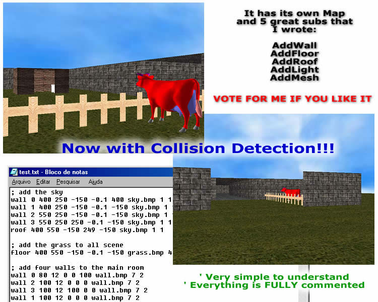

<div align="center">

## Direct3D 1st Person Game \(With Collision Detection\)


</div>

### Description

This is the UPDATE of my first DirectX program.

I've read one tutorial about

DirectX 7 last week, I think DirectX 7 is easyer than DirectX 8.

The EngineX of Simon Price and other excellent Engines at PSC

gave me desire to make my own 3D Game.

Well, it was made some days ago, so it's not finished.

I need some help to use DirectInput

to look around with the mouse and to add a more realistic sky.

I'd like to know how to make a landscape, like in TrueVision.

I made the map style, I think it is a good method.

I also made 5 subs that are very usefull, AddWall, AddFloor,

AddRoof, AddLight and AddMesh, It is all explained in the source.

----

UPDATED 

----

I've added Collision Detection to my project. I hope you enjoy it.

PLEASE, VOTE FOR ME IF YOU LIKE IT AND LEAVE SOME FEEDBACKS,

TELL ME WHAT YOU THINK.

Sorry, I couldn't upload it to PSC, I don't know why.

Please download it at:

http://planeta.terra.com.br/informatica/fredisoft/downloads/Direct3DGame.zip

** IMPORTANT **

Do not use any downloader, like GetRight, Gozzila, etc...

Turn it off.
 
### More Info
 


<span>             |<span>
---                |---
**Submitted On**   |
**By**             |[Frederico Machado](https://github.com/Planet-Source-Code/PSCIndex/blob/master/ByAuthor/frederico-machado.md)
**Level**          |Beginner
**User Rating**    |4.9 (132 globes from 27 users)
**Compatibility**  |VB 6\.0
**Category**       |[DirectX](https://github.com/Planet-Source-Code/PSCIndex/blob/master/ByCategory/directx__1-44.md)
**World**          |[Visual Basic](https://github.com/Planet-Source-Code/PSCIndex/blob/master/ByWorld/visual-basic.md)
**Archive File**   |[](https://github.com/Planet-Source-Code/frederico-machado-direct3d-1st-person-game-with-collision-detection__1-32114/archive/master.zip)


### Source Code

```
Sorry, I couldn't upload it to PSC, I don't know why.
Please download it at:
http://planeta.terra.com.br/informatica/fredisoft/downloads/Direct3DGame.zip
** IMPORTANT **
Do not use any downloader, like GetRight, Gozzila, etc...
Turn it off.
```

